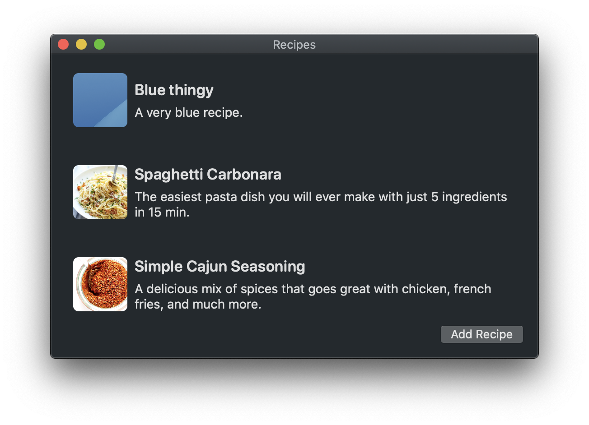

A sample app showing how to sync a user's private data using CloudKit.

This app was written as a companion for [my article on CloudKit](https://rambo.codes/posts/2020-02-25-cloudkit-101). It's written in SwiftUI and requires a paid developer account so that you can set up a CloudKit container to be used with the app.

